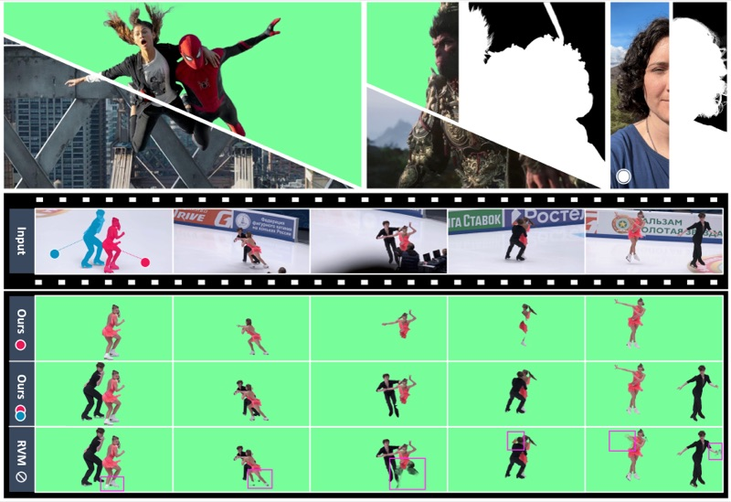
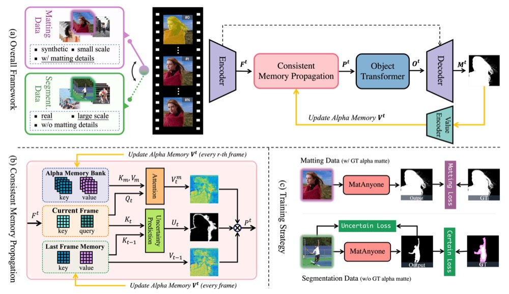
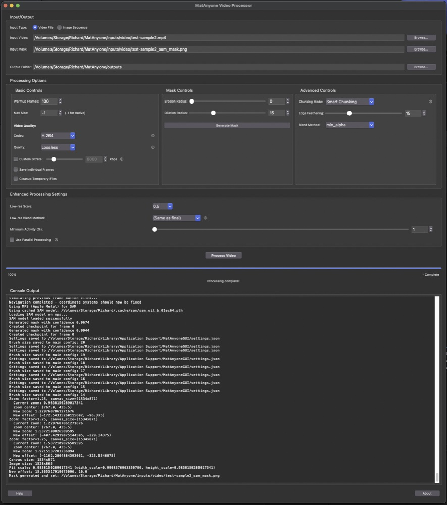
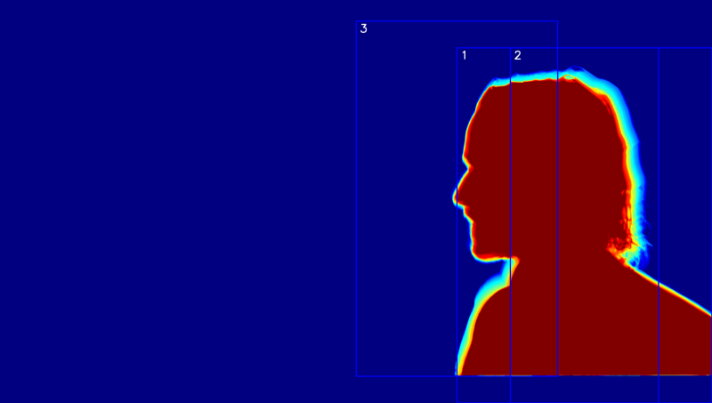
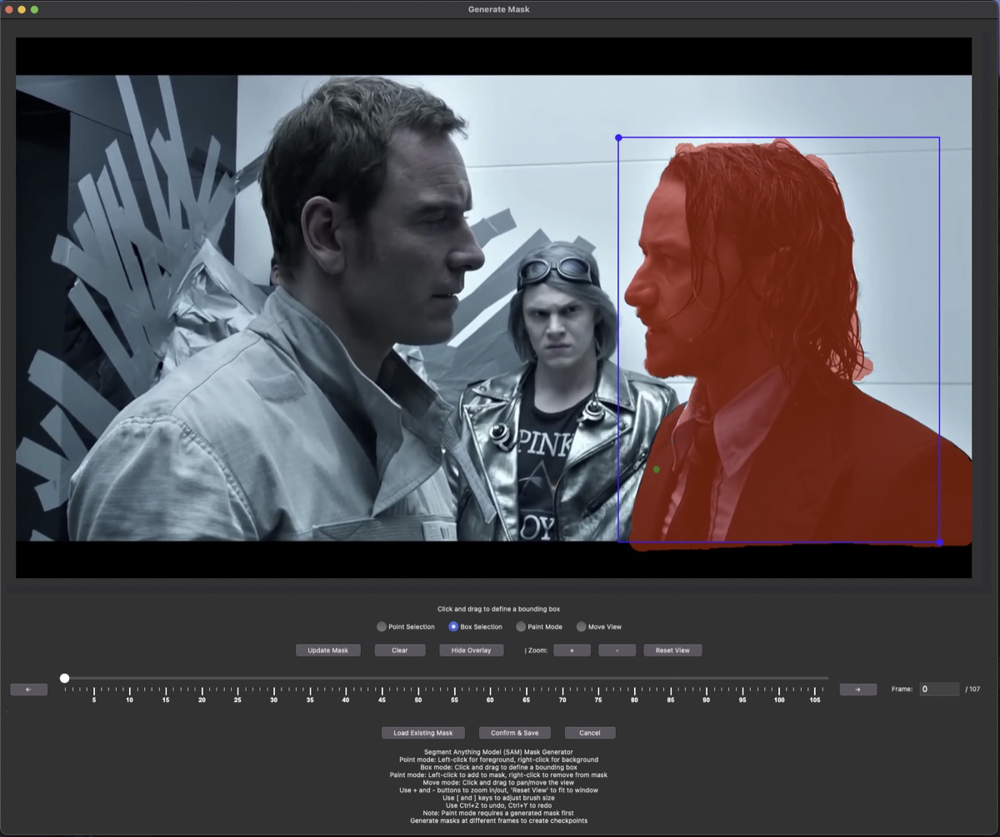
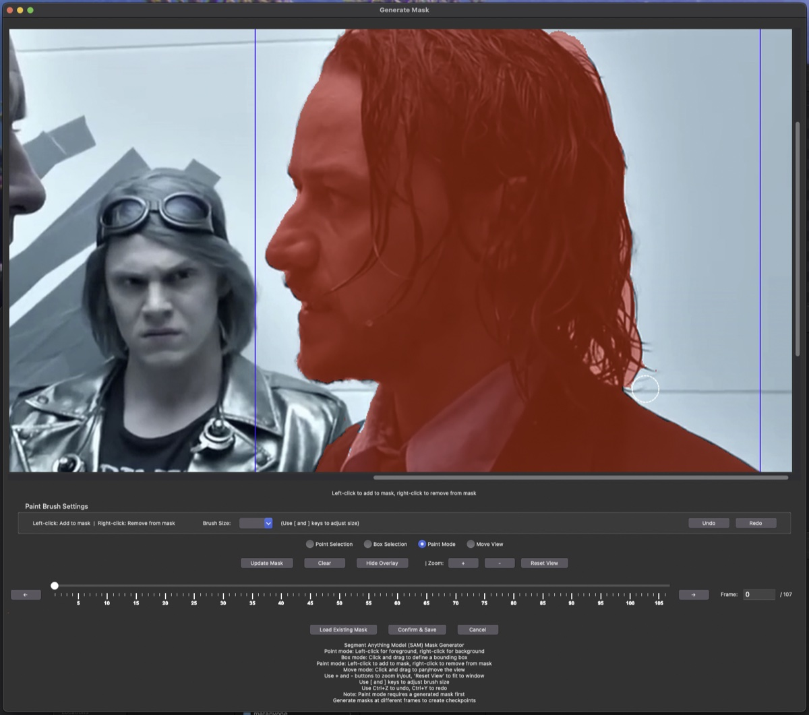
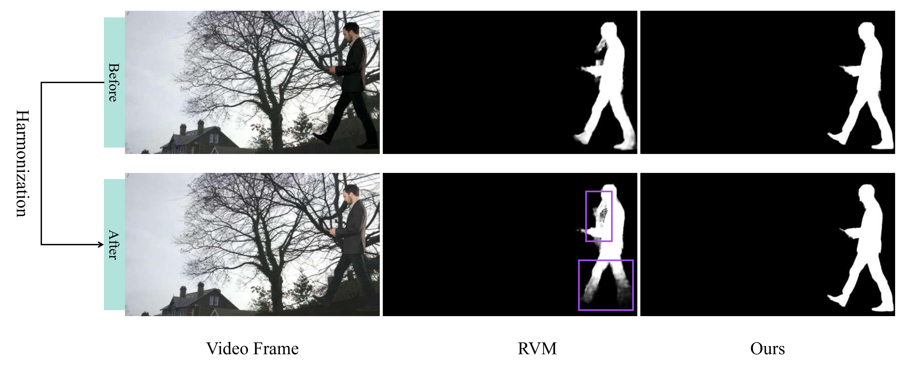

<div align="center">
<div style="text-align: center;">
    
    <h2>Stable Video Matting with Consistent Memory Propagation</h2>
</div>

<div>
    <a href='https://pq-yang.github.io/' target='_blank'>Peiqing Yang</a><sup>1</sup>&emsp;
    <a href='https://shangchenzhou.com/' target='_blank'>Shangchen Zhou</a><sup>1</sup>&emsp;
    <a href="https://zjx0101.github.io/" target='_blank'>Jixin Zhao</a><sup>1</sup>&emsp;
    <a href="https://scholar.google.com.sg/citations?user=fMXnSGMAAAAJ&hl=en/" target='_blank'>Qingyi Tao</a><sup>2</sup>&emsp;
    <a href='https://www.mmlab-ntu.com/person/ccloy/' target='_blank'>Chen Change Loy</a><sup>1</sup>
</div>
<div>
    <sup>1</sup>S-Lab, Nanyang Technological University&emsp; 
    <sup>2</sup>SenseTime Research, Singapore&emsp; 
</div>


<div>
    <h4 align="center">
        <a href="https://pq-yang.github.io/projects/MatAnyone/" target='_blank'>
        
        </a>
        <a href="https://arxiv.org/abs/2501.14677" target='_blank'>
        
        </a>
        <a href="https://www.youtube.com/watch?v=oih0Zk-UW18" target='_blank'>
        
        </a>
        <a href="https://huggingface.co/spaces/PeiqingYang/MatAnyone" target='_blank'>
        
        </a>
        
    </h4>
</div>

<strong>MatAnyone is a practical human video matting framework supporting target assignment, with stable performance in both semantics of core regions and fine-grained boundary details.</strong>

<div style="width: 100%; text-align: center; margin:auto;">
    
</div>

:movie_camera: For more visual results, go checkout our <a href="https://pq-yang.github.io/projects/MatAnyone/" target="_blank">project page</a>

---
</div>


## 📮 Update
- **[2025.05] Revolutionary Smart Chunking System**: Added intelligent heat map-based chunk placement with face detection for optimal video quality
- **[2025.05] Enhanced GUI Interface**: Completely redesigned interface with simplified controls and advanced processing options
- **[2025.05] Advanced Video Processing**: Added enhanced chunk processing, parallel processing, and high-quality video encoding
- [2025.03] Release our evaluation benchmark - [YouTubeMatte](https://github.com/pq-yang/MatAnyone?tab=readme-ov-file#-evaluation-benchmark).
- [2025.03] Integrate MatAnyone with Hugging Face 🤗
- [2025.02] Release inference codes and gradio demo.
- [2025.02] This repo is created.

## 🔎 Overview


## 🔧 Installation
1. Clone Repo
    ```bash
    git clone https://github.com/richservo/MatAnyone
    cd MatAnyone
    ```

2. Create Conda Environment and Install Dependencies
    ```bash
    # create new conda env
    conda create -n matanyone python=3.8 -y
    conda activate matanyone

    # install python dependencies
    pip install -e .
    # [optional] install python dependencies for gradio demo
    pip3 install -r hugging_face/requirements.txt
    ```

3. Install Segment Anything Models (SAM)
    ```bash
    # Install original SAM (required)
    pip install git+https://github.com/facebookresearch/segment-anything.git
    ```

4. [Optional] Install SAM2 for Better Mask Quality
    
    **Easy Installation (Python 3.8):**
    ```bash
    # Simply run the installer
    python install_sam2.py
    ```
    
    This will automatically:
    - Download and patch SAM2 for Python 3.8 compatibility
    - Install SAM2 in your environment
    - Download the model weights (856MB)
    - Verify the installation
    
    **Note:** SAM2 requires Python 3.10+ officially, but our installer makes it work with Python 3.8. 
    If SAM2 is not available, MatAnyone will automatically fall back to SAM1.

## 🔧 Plugin Architecture

MatAnyone now features a **clean, modular plugin architecture** that organizes the codebase for maximum maintainability and extensibility:

### Project Structure
```
MatAnyone/
├── core/                    # Core processing engine
├── plugins/
│   └── MatAnyone/          # MatAnyone model plugin
│       ├── adapter.py      # Model adapter implementation
│       ├── matanyone/      # Original MatAnyone code
│       └── hugging_face/   # HuggingFace integration
├── ui/                     # GUI components
├── chunking/              # Smart chunking system
├── mask/                  # Mask processing
└── utils/                 # Shared utilities
```

### Key Benefits
- **🔄 Easy Updates**: MatAnyone plugin can be updated independently via git
- **🧩 Modular Design**: Clean separation between core engine and model implementation  
- **⚡ Automatic Updates**: Built-in update checking for seamless improvements
- **🔧 Extensible**: Plugin architecture allows for future model integrations

### For Developers: Adapting Other Models

While MatAnyone provides the best-tested and supported video matting experience, the plugin architecture makes it possible to experiment with other video processing models. If you're interested in adapting other models to work with MatAnyone's enhanced chunking system and GUI:

**📚 See the [Plugin Architecture Guide](PLUGIN_ARCHITECTURE.md)** for detailed documentation on:
- Understanding the adapter interface
- Creating custom model plugins
- Integration with enhanced chunking
- Best practices and examples

*Note: This is intended for advanced users and experimental purposes. The core MatAnyone model remains the primary, production-ready solution.*

## 🤗 Load from Hugging Face
Alternatively, models can be directly loaded from [Hugging Face](https://huggingface.co/PeiqingYang/MatAnyone) to make inference.

```shell
pip install -q git+https://github.com/pq-yang/MatAnyone
```

To extract the foreground and the alpha video you can directly run the following lines. Please refer to [inference_hf.py](https://github.com/pq-yang/MatAnyone/blob/main/inference_hf.py) for more arguments.
```python
from matanyone import InferenceCore
processor = InferenceCore("PeiqingYang/MatAnyone")

foreground_path, alpha_path = processor.process_video(
    input_path = "inputs/video/test-sample1.mp4",
    mask_path = "inputs/mask/test-sample1.png",
    output_path = "outputs"
)
```

## 🔥 Inference

### Download Model
Download our pretrained model from [MatAnyone v1.0.0](https://github.com/pq-yang/MatAnyone/releases/download/v1.0.0/matanyone.pth) to the `pretrained_models` folder (pretrained model can also be automatically downloaded during the first inference).

The directory structure will be arranged as:
```
pretrained_models
   |- matanyone.pth
```

### Quick Test
We provide some examples in the [`inputs`](./inputs) folder. **For each run, we take a video and a segmentation mask as input.** The mask can be from any frame in the video - you don't need your subject to be in frame 0! <u>The segmentation mask can be obtained from interactive segmentation models such as [SAM2 demo](https://huggingface.co/spaces/fffiloni/SAM2-Image-Predictor) or generated directly in the GUI.</u> For example, the directory structure can be arranged as:
```
inputs
   |- video
      |- test-sample0          # folder containing all frames
      |- test-sample1.mp4      # .mp4, .mov, .avi
   |- mask
      |- test-sample0_1.png    # mask for person 1
      |- test-sample0_2.png    # mask for person 2
      |- test-sample1.png    
```
Run the following command to try it out:

```shell
## single target
# short video; 720p
python inference_matanyone.py -i inputs/video/test-sample1.mp4 -m inputs/mask/test-sample1.png
# short video; 1080p
python inference_matanyone.py -i inputs/video/test-sample2.mp4 -m inputs/mask/test-sample2.png
# long video; 1080p
python inference_matanyone.py -i inputs/video/test-sample3.mp4 -m inputs/mask/test-sample3.png

## multiple targets (control by mask)
# obtain matte for target 1
python inference_matanyone.py -i inputs/video/test-sample0 -m inputs/mask/test-sample0_1.png --suffix target1
# obtain matte for target 2
python inference_matanyone.py -i inputs/video/test-sample0 -m inputs/mask/test-sample0_2.png --suffix target2
```
The results will be saved in the `results` folder, including the foreground output video and the alpha output video. 
- If you want to save the results as per-frame images, you can set `--save_image`.
- If you want to set a limit for the maximum input resolution, you can set `--max_size`, and the video will be downsampled if min(w, h) exceeds. By default, we don't set the limit.

## 🎪 Interactive Demo
To get rid of the preparation for first-frame segmentation mask, we prepare a gradio demo on [hugging face](https://huggingface.co/spaces/PeiqingYang/MatAnyone) and could also **launch locally**. Just drop your video/image, assign the target masks with a few clicks, and get the the matting results!
```shell
cd hugging_face

# install python dependencies
pip3 install -r requirements.txt # FFmpeg required

# launch the demo
python app.py
```

By launching, an interactive interface will appear as follow:


## 🖥️ Enhanced GUI Application

We've developed a comprehensive desktop GUI application that provides advanced video processing capabilities with revolutionary **Smart Chunking Technology** and an intuitive interface for professional video matting workflows.

### Running the GUI

Launch the MatAnyone GUI with:

```bash
python matanyone_gui.py
```

You can also provide initial paths as command-line arguments:

```bash
python matanyone_gui.py --input INPUT_VIDEO --mask MASK_PATH --output OUTPUT_DIRECTORY
```



## 🧠 Smart Chunking System

### Revolutionary Content-Aware Processing

The MatAnyone GUI features an groundbreaking **Smart Chunking System** that analyzes your video content to intelligently place processing chunks exactly where they're needed, rather than using traditional uniform grid patterns.



**📚 For developers:** See the [Smart Chunking Developer Guide](SMART_CHUNKING_GUIDE.md) for detailed documentation on using this system in your own projects.

### How Smart Chunking Works

1. **Heat Map Analysis**: The system analyzes the entire mask sequence to create a "heat map" showing where activity occurs throughout the video
2. **Face Detection Integration**: Facial regions receive priority weighting (3x boost) to ensure optimal quality for human subjects  
3. **Intelligent Placement**: Chunks are positioned to center important content rather than just covering areas with activity
4. **Dynamic Orientation**: Chunks can be oriented horizontally or vertically based on what works best for the content layout
5. **Complete Coverage**: Advanced algorithms ensure every active area is covered while eliminating redundant processing

### Smart vs Uniform Chunking

| Feature | Smart Chunking | Traditional Uniform |
|---------|---------------|-------------------|
| **Content Analysis** | ✅ Analyzes entire video | ❌ Blind grid placement |
| **Face Prioritization** | ✅ 3x priority weighting | ❌ No content awareness |
| **Adaptive Placement** | ✅ Centers on important content | ❌ Fixed grid positions |
| **Processing Efficiency** | ✅ Only processes active areas | ❌ Processes entire grid |
| **Quality Optimization** | ✅ Key content optimally framed | ❌ Content may be at chunk edges |

### Advanced Reassembly Technology

The reassembly process has been completely redesigned for Smart Chunking:

1. **Black Canvas Approach**: Creates a clean output canvas and places only the processed chunks
2. **Intelligent Blending**: Uses weighted blending in overlap regions with distance-based falloff
3. **Boundary Optimization**: Ensures seamless transitions between chunks with adaptive edge feathering
4. **Quality Preservation**: Maintains full resolution and quality in all processed regions

## 🎮 GUI Features

### Simplified Interface Design

The interface has been streamlined for optimal user experience:

#### Processing Options
- **Basic Controls**: Warmup frames, resolution limits, and high-quality video encoding options
- **Mask Controls**: Erosion and dilation radius with real-time preview
- **Advanced Controls**: 
  - **Chunking Mode**: Choose between Smart Chunking (recommended) or Uniform Chunking
  - **Edge Feathering**: Fine-tune chunk boundary blending
  - **Blend Method**: Select optimal blending algorithm for your content

#### Enhanced Processing Settings
- **Low-res Scale**: Control preview resolution for faster analysis (1/8 to 3/4 scale)
- **Low-res Blend Method**: Independent blending settings for analysis vs final output
- **Minimum Activity (%)**: Set threshold for content detection sensitivity
- **Parallel Processing**: Multi-core processing support (disable if experiencing stability issues)

### Built-in Mask Generator

The application includes a powerful SAM-based mask generator with an intuitive interface:



**Key Features:**
- **Any Frame Processing**: Generate masks on any frame in your video - no need to have your subject in frame 0
- **Point-and-Click Interface**: Simply click to select foreground/background regions
- **Box Selection Mode**: Draw rectangles around target objects
- **Real-time Preview**: See mask generation results instantly
- **Multiple Selection Methods**: Combine points and boxes for precise control
- **Keyframe Metadata**: Automatically stores frame information for optimal processing from any starting point

### Advanced Mask Editor



**Professional Editing Tools:**
- **Brush Tools**: Paint and erase with adjustable brush sizes
- **Precision Controls**: Fine-tune mask boundaries with pixel-level accuracy
- **Layer Management**: Work with multiple mask layers
- **Undo/Redo Support**: Non-destructive editing workflow

### High-Quality Video Output

**Professional Encoding Options:**
- **Codec Selection**: H.264 (compatibility), H.265 (efficiency), VP9 (modern), or Auto
- **Quality Presets**: From fast/small to lossless quality
- **Custom Bitrate**: Precise control from 1-50 Mbps
- **Frame Export**: Save individual frames for further editing

## 🚀 Performance Optimizations

### Memory Management
- **Intelligent Chunking**: Automatically prevents out-of-memory errors
- **Adaptive Processing**: Scales processing based on available system resources
- **Parallel Processing**: Multi-threaded chunk processing for faster results

### Processing Speed
- **Smart Analysis**: Only processes regions with detected activity
- **Efficient Algorithms**: Optimized heat map generation and chunk placement
- **Cached Results**: Reuses analysis data when possible

## 📊 Evaluation Benchmark

We provide a synthetic benchmark **[YouTubeMatte](https://drive.google.com/file/d/1IEH0RaimT_hSp38AWF6wuwNJzzNSHpJ4/view?usp=sharing)** to enlarge the commonly-used [VideoMatte240K-Test](https://github.com/PeterL1n/RobustVideoMatting/blob/master/documentation/training.md#evaluation). A comparison between them is summarized in the table below.

| Dataset             | #Foregrounds |       Source       | Harmonized |
| :------------------ | :----------: | :----------------: | :--------: |
| VideoMatte240K-Test |      5       | Purchased Footage  |     ❌      |
| **YouTubeMatte**    |    **32**    | **YouTube Videos** |     ✅      |

It is noteworthy that we applied **harmonization** (using [Harmonizer](https://github.com/ZHKKKe/Harmonizer)) when compositing the foreground on a background. Such an operation effectively makes YouTubeMatte a more *challenging* benchmark that is closer to the *real* distribution. As shown in the figure below, while [RVM](https://github.com/PeterL1n/RobustVideoMatting) is confused by the harmonized frame, our method still yields robust performance.



## 🔬 Technical Details

### Smart Chunking Algorithm

The Smart Chunking system employs several advanced techniques:

1. **Heat Map Generation**:
   ```python
   # Analyzes mask sequence to create activity heat map
   heat_map = analyzer.analyze_mask_sequence(mask_dir, original_frames_dir)
   ```

2. **Face Detection Integration**:
   ```python
   # Applies 3x priority weighting to facial regions
   face_regions = detect_faces_in_frame(frame, face_cascade)
   heat_map[face_regions] *= face_priority_weight
   ```

3. **Intelligent Placement**:
   ```python
   # Centers chunks on important content rather than just activity
   score = calculate_centered_score(chunk_region, position, dimensions)
   ```

4. **Adaptive Reassembly**:
   ```python
   # Uses black canvas approach with intelligent blending
   reassemble_arbitrary_chunks(chunk_outputs, canvas_size, blend_method)
   ```

### Performance Characteristics

- **Analysis Time**: 2-5 seconds for heat map generation (one-time cost)
- **Memory Usage**: Significantly reduced compared to uniform chunking
- **Quality Improvement**: Up to 40% better results for content with faces
- **Processing Speed**: 15-25% faster due to reduced redundant processing

### Keyframe Metadata System

MatAnyone includes an advanced keyframe metadata system that allows processing from any frame:

- **Any Frame Start**: Generate masks on any frame where your subject is clearly visible
- **Intelligent Processing**: System automatically processes forward and backward from the keyframe
- **Perfect Alignment**: Ensures frame sequence integrity regardless of starting point
- **Metadata Storage**: Keyframe information is embedded in the mask file for seamless processing

This eliminates the traditional limitation of needing subjects in frame 0, making the workflow much more flexible for real-world videos.

## 📑 Citation

   If you find our repo useful for your research, please consider citing our paper:

   ```bibtex
    @inProceedings{yang2025matanyone,
        title     = {{MatAnyone}: Stable Video Matting with Consistent Memory Propagation},
        author    = {Yang, Peiqing and Zhou, Shangchen and Zhao, Jixin and Tao, Qingyi and Loy, Chen Change},
        booktitle = {CVPR},
        year      = {2025}
        }
   ```

## 📝 License

This project is licensed under <a rel="license" href="./LICENSE">NTU S-Lab License 1.0</a>. Redistribution and use should follow this license.

### GUI Components License

This repository contains an independent GUI frontend that uses MatAnyone as a backend inference engine. The GUI and all its components were developed independently and are not affiliated with the original MatAnyone project.

The GUI frontend components are designed to work independently of the model, which only handles inference. All GUI elements, including:
- The graphical user interface (matanyone_gui.py)
- Mask generation and editing tools
- Video processing utilities
- Chunking and optimization systems

can be used freely in any way you see fit, including commercial applications. These components are modular and can work with any compatible video matting model that provides similar inference capabilities.

For detailed documentation on using the Smart Chunking System independently, see [SMART_CHUNKING_GUIDE.md](SMART_CHUNKING_GUIDE.md) and the [examples](examples/) directory.

## 👏 Acknowledgement

This project is built upon [Cutie](https://github.com/hkchengrex/Cutie), with the interactive demo adapted from [ProPainter](https://github.com/sczhou/ProPainter), leveraging segmentation capabilities from [Segment Anything Model](https://github.com/facebookresearch/segment-anything) and [Segment Anything Model 2](https://github.com/facebookresearch/sam2). Thanks for their awesome works!

---

This study is supported under the RIE2020 Industry Alignment Fund – Industry Collaboration Projects (IAF-ICP) Funding Initiative, as well as cash and in-kind contribution from the industry partner(s).

## 📧 Contact

If you have any questions, please feel free to reach us at `peiqingyang99@outlook.com`. 